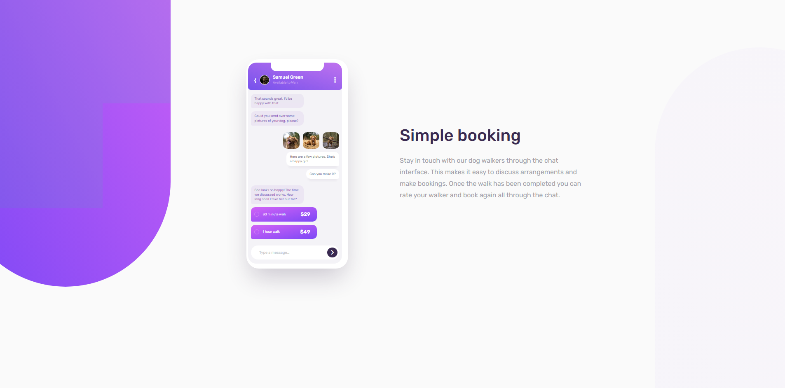
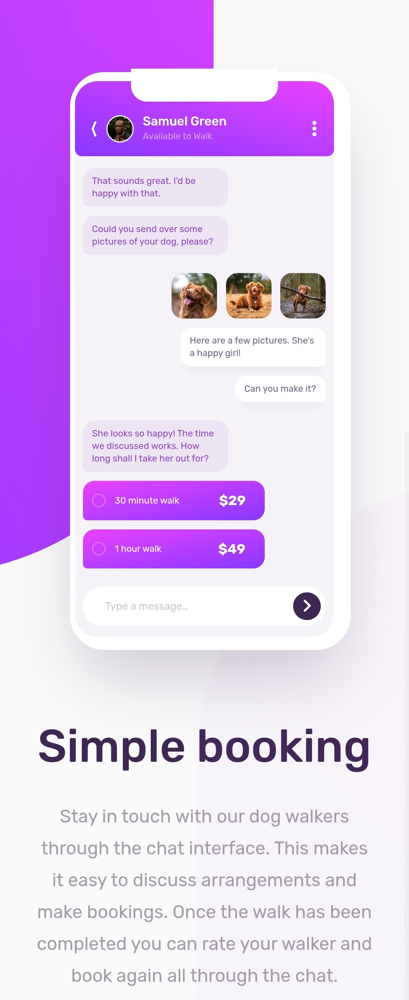

# 🐧 Chat app CSS illustration - Page Solution 

This is my first solution to the [Chat app CSS illustration challenge on Frontend Mentor](https://www.frontendmentor.io/challenges/chat-app-css-illustration-O5auMkFqY/hub) and took me 50 hours to complete. Frontend Mentor challenges help you improve your coding skills by building realistic projects. If you are a beginner you really need to try this!

## 📷 Screenshots

## 🎥 Live WebSite

- [Live site URL](https://alexandru-ghergu.github.io/chat-app-css-illustration-master/)

## ✨ Technologies

- `HTML5`
- `CSS`
- `SASS`

## 🎢 What I learned

- 'Still Learning'
